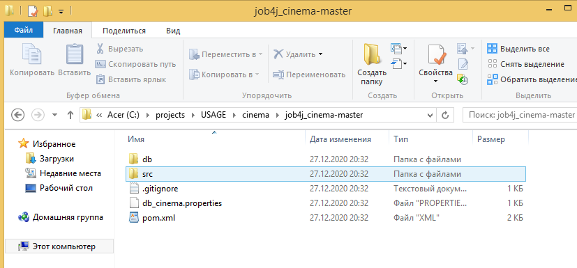
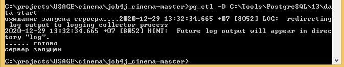
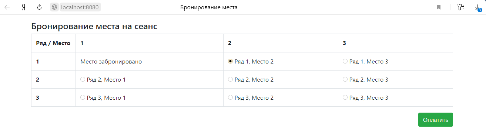
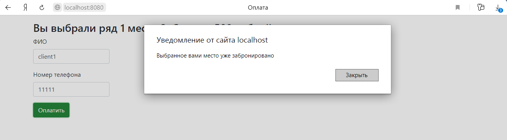

# Проект - Cinema

# Содержание
* [Использованные технологии](#Использованные-технологии)
* [О проекте](#О-проекте)
* [Сборка](#Сборка)
* [Использование](#Использование)
* [Контакты](#Контакты)
## Использованные технологии
* Servlets
* PostgreSQL
* Collections Framework
* SLF4J и Log4j
* Библиотека GSON
* Apache Commons DBCP (Database Connection Pooling)
* HTML, CSS
* JS, JQuery, Bootstrap
* AJAX
* Travis CI
## О проекте
* Приложение представляет собой веб-сайт по покупке билетов в кинотеатр:  
  
Как видно, на главной странице отображается зал с рядами.  
* Если место забронировано, то это отображается в таблице:  
  
* На главной странице используется динамическое обновление контента с помощью AJAX (ежесекундно).  
* После того как пользователь выбрал место, можно перейти на страницу оплаты:  
  
Здесь указывается ФИО пользователя и его номер.  
* Страницы реализованы на HTML и Bootstrap  
* Для корректной обработки ситуации, в которой несколько пользователей одновременно бронируют одно и то же место, 
осуществляется проверка как на стороне клиента (с помощью JS), так и на стороне сервера.  
* Для работы с JSON используется библиотека GSON  
* Большинство операций осуществляется на стороне клиента с помощью JS, JQuery и AJAX-запросов. 
Сервер лишь сохраняет или отправляет данные в JSON-формате  
* Все запросы к серверу посылаются в виде AJAX-запросов  
* Реализована валидация вводимых пользователем данных с помощью нативного JS:  
  
  
* На сервере реализовано 2 слоя: слой контроллеров и слой по работе с БД. Слой контроллеров реализован на сервлетах. 
Слой по работе с БД - на JDBC.  
* В качестве БД используется PostgreSQL.  
* Пул соединений к БД основан на Apache Commons DBCP2   
* В качестве системы логирования используется slf4j, который использует log4j.
## Сборка
1. Установить JDK 14.
2. Скачать Maven.
3. Создать переменные окружения JAVA_HOME и M2_HOME и прописать в переменную окружения Path 
пути до бинарных файлов для JDK и для Maven:  
  
4. Установить сервер БД PostgreSQL. При установке задать: 
    * имя пользователя - postgres 
    * пароль - root
    * порт - 5432 
Также при установке сервера БД PostgreSQL нужно установить программу pg_Admin.

5. Скачать и установить Tomcat.
6. Скачать исходный код проекта с GitHub.
7. Перейти в корень проекта, где лежит файл pom.xml:  
  
  
8. С помощью Maven осуществить сборку проекта:  
  
При успешной сборке должна появиться папка target, в которой располагается war-архив:  
  
  
  
9. Переименовать war-архив:  
  
10. Запустить сервер БД, указав путь до папки data:  
  
11. Запустить программу pg_Admin, установленную вместе с сервером БД PostgreSQL:  
  
12. Создать БД с названием cinema:  
  
13. Открыть Query Tool для созданной БД и запустить SQL-скрипт create.sql, 
находящийся в папке db (данная папка находится в корне скачанного проекта):  
  
  
14. Задеплоить собранный war-архив в папку webapps, находящуюся в корневой папке скачанного Tomcat:  
  
15. Скопировать файл db_cinema.properties, находящийся в корне скачанного проекта в папку bin, 
находящуюся в корневой папке скачанного Tomcat:  
  
  
Сборка завершена. Теперь можно проверить работу приложения.
## Использование
Запускаем Tomcat:  
  
  
Переходим на главную страницу приложения
[http://localhost:8080/cinema/](http://localhost:8080/cinema/):   
  
Забронируем первое место в первом ряду:  
  
  
  
  
Проверим валидацию. Нажмём кнопку "Оплатить" на главной странице, при этом не выбрав место:  
  
Теперь проверим валидацию формы:  
  
Как видно, валидация работает.  
Сымитируем ситуацию, в которой несколько клиентов пытаются забронировать одно и то же место.  
Пусть первый клиент начинает бронировать второе место в первом ряду:  
  
  
В это время второй клиент полностью бронирует второе место в первом ряду:  
  
  
  
  
Теперь возвращаемся к первому клиенту:  
  
Нажимаем кнопку "Оплатить":  
  
Как видно, в данной ситуации приложение отрабатывает корректно.
## Контакты
Почта: studentnstu97@mail.ru 
Skype: live:.cid.9cdc925fb48220b4